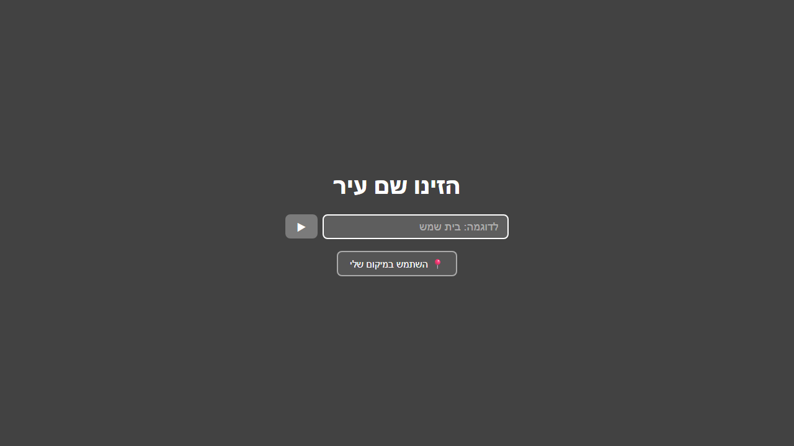
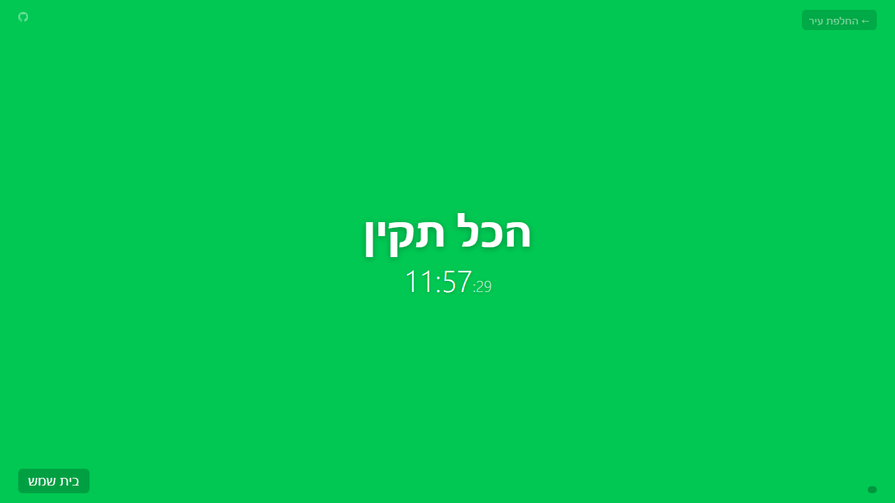
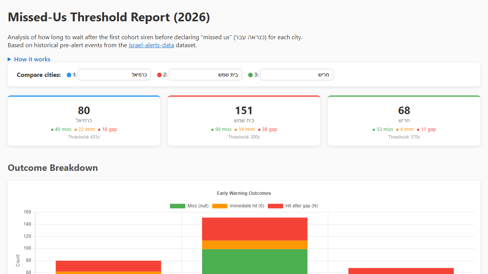

# Oref Alert Display

Fullscreen traffic-light alert for Israeli cities.

A web-based alert display for Pikud HaOref (Israeli Home Front Command) alerts. Shows a fullscreen color (green/yellow/red) for a specific city. Designed for wall-mounted displays, kiosk mode, or personal use.

## Screenshots

| City picker | Green (all-clear) state | Missed-Us Threshold Report |
|:-----------:|:-----------------------:|:--------------------------:|
|  |  |  |

## Usage

```
https://orefalertst.z39.web.core.windows.net/?city=בית שמש
```

Replace `בית שמש` with your city name in Hebrew. The city name must match exactly as it appears in Pikud HaOref data.

## Usage Tips

### Choosing a city

Open the site without a `?city=` parameter to see the **city picker** page. Start typing a city name in Hebrew — an autocomplete dropdown will appear. You can also click the **📍 "Use my location"** button to detect the nearest city via browser geolocation.

### URL parameters

| Parameter | Example | Description |
|-----------|---------|-------------|
| `city` | `?city=בית שמש` | City to monitor (Hebrew, URL-encoded) |
| `missedus` | `?city=בית שמש&missedus=120` | Override the "missed us" threshold in **seconds** (default is per-city from historical data) |

### Report page

The **Missed-Us Threshold Report** is available at [`/report.html`](https://orefalertst.z39.web.core.windows.net/report.html). It analyses historical pre-alert events to determine the optimal "missed us" threshold per city.

- Compare up to 3 cities side-by-side using the city picker at the top.
- City selections are stored in the URL hash — e.g. `report.html#כרמיאל,בית שמש,חריש` — so you can bookmark or share a comparison link.

### What does "כנראה עבר" (amber) mean?

When a PRE_ALERT (early warning) arrives and nearby cities in the same alert cohort receive sirens but **your city does not**, the display transitions to an amber/yellow-orange state labelled **כנראה עבר** ("probably passed"). This means at least 95% of historical events with the same pattern did not result in a siren for your city. Click the **?** button on screen for details about the specific threshold used.

## Colors

| Color | Meaning | Hebrew |
|-------|---------|--------|
| 🟢 Green | All clear | הכל תקין |
| 🟡 Yellow | Early warning | התראה מוקדמת |
| 🟠 Amber | Probably passed — cohort sirens heard, your city was not hit | כנראה עבר |
| 🔴 Red | Active siren | !אזעקה |

## Features

- Real-time polling (5-second updates)
- Responsive design (works on any screen size)
- Clock display
- Event log overlay
- "Missed us" amber state with per-city thresholds
- Geolocation-based city detection
- 7-day session timeout (prevents abandoned tabs)
- No external dependencies

## Architecture

- **Azure Function** (Python, timer trigger) polls oref.org.il from Israel Central
- Writes raw alert data to **Azure Blob Storage**
- **Static HTML** served from same blob storage (no CORS issues)
- Client-side JavaScript classifies alerts for the specified city

## Deployment

Requires an Azure subscription with the Israel Central region.

- Infrastructure deployed via **Bicep** (`infra/`)
- CI/CD via **GitHub Actions** with OIDC federated credentials
- Push to `main` triggers deployment automatically
  - Changes to `infra/**` trigger infrastructure deployment
  - All other changes trigger function + web deployment

### Required GitHub secrets

| Secret | Description |
|--------|-------------|
| `AZURE_CLIENT_ID` | App registration client ID (federated credential) |
| `AZURE_TENANT_ID` | Azure AD tenant ID |
| `AZURE_SUBSCRIPTION_ID` | Azure subscription ID |

### Required GitHub variables

| Variable | Description |
|----------|-------------|
| `AZURE_FUNCTIONAPP_NAME` | Name of the Azure Function App |

## Based on

Alert classification logic ported from [amitfin/oref_alert](https://github.com/amitfin/oref_alert) Home Assistant integration.
